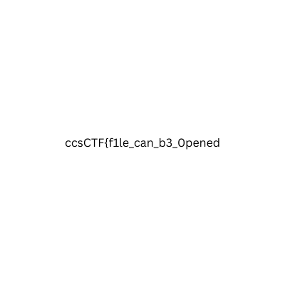

# Bipolar

Using the `file` command will reveal the `.pdf` to be a `.png`.

Renaming the file to `bipolar.png` and opening it will give you the first part of the flag.

Use the `foremost` command on the image to find the hidden `.pdf` with the final part of the flag.

> Flag : ccsCTF{f1le_can_b3_0pened_by_many_ways}